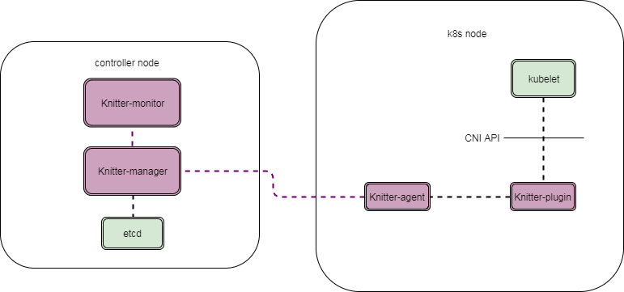
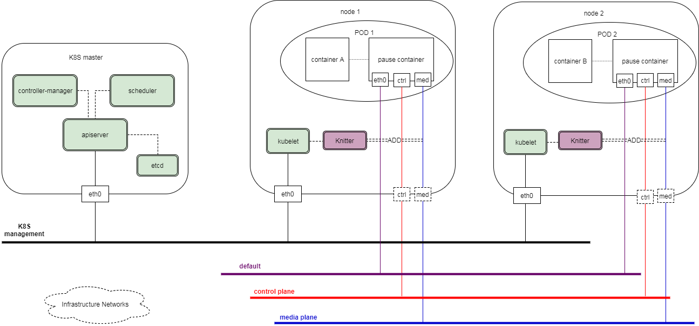

# Knitter

## Overview
- is a [CNI](https://github.com/containernetworking/cni) plugin to support multiple network interfaces in a [Kubernetes](https://github.com/kubernetes/kubernetes) pod.
- provides the ability for a pod (e.g., VNF in pod) to attach to high-performance networks. 
- allows users specifying customized networks according to their infrastructure.
- can run on public clouds, private clouds and hybrid clouds.
- supports both VM and bare-metal cloud environments.

## Architecture

Knitter includes three components:
- **Knitter-manager**: it runs on a central controller node (which can be K8S master or a separate host). It interactives with network infrastructure and manages the network(s) that used by the cluster. `Knitter-manager` serves as an API server.
- **Knitter-plugin**: it's a CNI plugin whick is invoked by kubelet with CNI API. It forwards the network setting up request from kubelet to `Knitter-agent` and sends the result back.
- **Knitter-agent**: it runs on each node of the K8S cluster. It processes the forwarded request fromm `Knitter-plugin`. It queries networks configured in annotations of pod spec from kube-apiserver. Then it requests `Knitter-manager` to allocate all the needed resources. Once all things are ready, it sets up the network stack for the pod. Once it finishes, it sends the result back to `Knitter-plugin`.
- **Knitter-monitor**:




One of the topology of K8S management network and pod networks is as below. It can vary depending on the mode of Knitter.



## Build
It is easy to build all knitter commponents, just need to run make build or make all commands.
```bash
make build 
or
make all
```
All knitter related binaries are placed into temp directory "_output", normally you will see 4 components(knitter-manager/knitter-monitor/knitter-agent/knitter-plugin). Knitter only surpport linux platform currently.

## Usage
Knitter is not a only CNI plugin, but it is a full network solutions.So if you'd like run knitter, you should install all related compontents of knitter including knitter-manger、knitter-monitor、knitter-agent、knitter-plugin.
All knitter binaries have a seperated configuration(use json formation currently), and you can check a full description from [knitter docs](https://github.com/HyperNetworks/Knitter/tree/master/docs).

## Contributing
Contributions should be made via pull requests. Pull requests will be reviewed by one or more maintainers and merged when acceptable.
All contributions are welcome - Knitter uses the Apache 2 license and does not require any contributor agreement to submit patches. Please open issues for any bugs or problems you encounter. We hope that before contributing, please make the effort to coordinate with the maintainers of the project before submitting high impact PRs. This will prevent you from doing extra work that may or may not be merged.Larger changes typically work best with design documents , similar to those found in [knitter docs](https://github.com/HyperNetworks/Knitter/tree/master/docs) . These are focused on providing context of the design at the time the feature was conceived and can inform future documentation contributions . Make sure that new tests are added for bugs in order to catch regressions and tests for new features to exercise the new functionality that is added .


If you want to run the test suite(especially e2e test), make sure you have your environment set up, and from the origin directory run:
```bash
make verify
```
After excute this command, it wili run verify process including check and unit test processes.
```bash
make test-ut
```
As you can see, it will only run unit test process.

```bash
make test-e2e
```
This will run knitter e2e test cases, but now we have't finish this process. We will finish this in next weeks.

