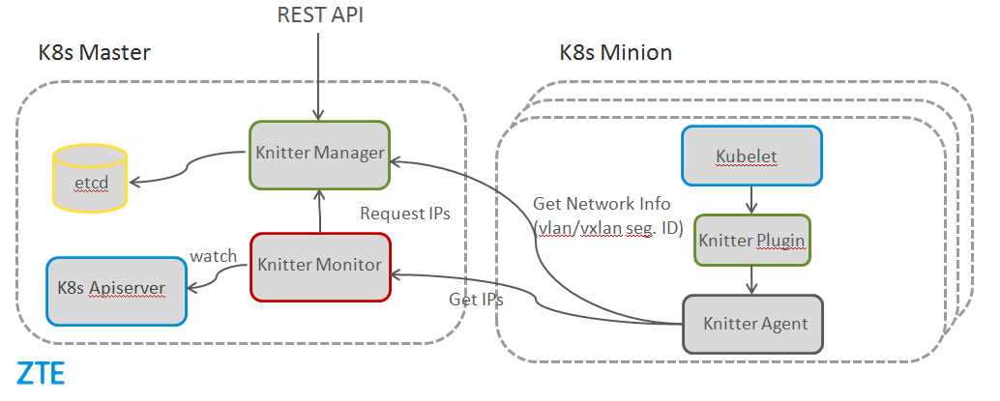
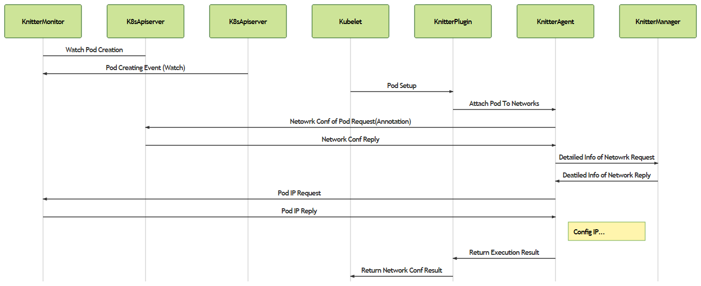

# Knitter Features and Design

## Brief introduction

- Knitter is a container networking solution, especially for NFV scenarios. With Knitter, developers can quickly develope/deploy NFV applications of telecommunication cloud native scenarios. Knitter provides a consistent high-level network abstract model to solve the networking orchestration for containerized applications in different use cases.

## Features

- support for multiple networks/interfaces.
	- in telecommunication scenarios, service data traffic is generally separated into several network planes, e.g., control plane, data plane and management plane. Those types of traffic have different QoS requirements. Multiple network interfaces are needed to isolate the networks and provide QoS ability. The current Kubernetes network model doesn't support multiple networks while Knitter can meet the multiple networks requirements.

- support for the native network model of Kubernetes

	- besides the support for multiple network planes, as it should be, Knitter supports the native network model of Kubernetes as well. The existing manifests of Pod can be deployed directly against the Knitter network without any modification.

- multiple tenants, network isolation and/or network sharing.

- integration of IPAM to allocate IP for pods.

- providing consistent network model in multiple types of physical network topology.

	- vxlan-based overlay network

	- (TODO) vlan or macvlan based underlay network

- stability mechanism of Pod IP address

	- in many cases, Pod need to have specified IP address or make sure its IP address not changing after restarting. Knitter introduces a concept of IP group which can support IP address stability well.

- (TODO) support for SR-IOV

## Architecture

Knitter includes four components: knitter-manager, knitter-monitor, knitter-pluging and knitter-agent. The architecture is shown as below.

### Knitter Manager

Knitter Manager is a centralized network manager. It provides REST API. Users can create/query/delete objects such as tenants and networks via REST API. Moreover, it is a resource manager which is in charge of management of Pod IP, network VLAN ID and VxLAN ID. Knitter Manager uses etcd as its backend data store to store the static configuration and runtime object information of the networks. Knitter Manager can manage networks of multi-cluster instead of single Kubernetes cluster.

### Knitter Monitor

Knitter Monitor can allocate and recycle IP resources by monitoring the lifecycle events such as the creation and deletion of Pod in Kubernetes. It uses the list-watch mechanism of Kubernetes apiserver. Monitor writes Pod IP information to the key-value data store. When the Pod networks are set up during the Pod creation, the IP allocated to the Pod will be retrieved from Monitor and configured to the network interfaces in the Pod.

### Knitter Plugin

Knitter Plugin is a simple forwarding component. When Pod is being created or deleted, it is invoked via CNI API. It parses network configuration information and then forwards the networks setting up request to Knitter Agent. After Knitter Agent finishes, Knitter Plugin passes the result back to container runtime.

### Knitter Agent

Knitter Agent is the execution entity for networks setting up of Pod. It gets network configuration by parsing Pod annotations and then acquires detailed network configuration information from Knitter Manager. After that, it executes different operations according to the different network types and network interfaces types.

  - for VxLAN network, it creates a veth pair to connect container and bridge. It generates flow table rules from network configuration information and configure the rules to the channel bridge. Finally it configures the required IP to the veth interface in the container.

  - for VLAN network, there are two different workflows according to the different driver type.

    - for OVS, it creates a veth pair and connects the two ends to the Pod and bridge. It then sets VLAN tag and configures IP to the veth interface in the container.

    - for SR-IOV, it allocates VF for the Pod and sets VLAN tag via a built-in VF manager. It then configures IP for the VF in the container.

## Interaction among the components

Take setting up networks for pod for example, the workflow of interaction among the components is shown as the below diagram.

